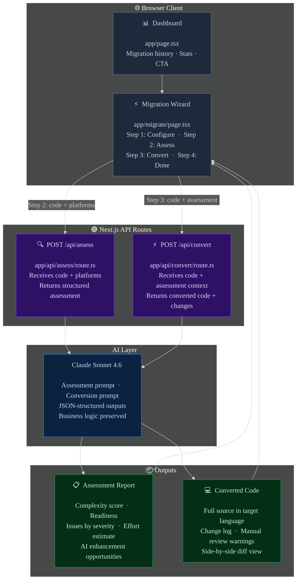

<div align="center">

<br/>

<h1>⚡</h1>

# MigrateAI

### AI-powered code migration platform for enterprise automation modernization

<br/>

[](https://github.com/pritmon/migrateai/actions/workflows/ci.yml)
[](https://migrateai.onrender.com)
[](https://nextjs.org)
[](https://typescriptlang.org)
[](https://anthropic.com)
[](https://tailwindcss.com)
[](LICENSE)
[](https://nodejs.org)

<br/>

[**→ Open Live Demo**](https://migrateai.onrender.com) &nbsp;·&nbsp;
[How It Works](#how-it-works) &nbsp;·&nbsp;
[Quick Start](#quick-start) &nbsp;·&nbsp;
[API Reference](#api-reference) &nbsp;·&nbsp;
[Supported Platforms](#supported-platforms)

<br/>

</div>

---

## About

**MigrateAI** is a production-ready AI code migration platform that modernizes legacy automation estates — RPA scripts, VBA macros, SQL procedures, and more — to modern platforms in seconds, not weeks.

It solves a real enterprise problem: organizations are stuck with brittle, unmaintainable automation built for a pre-AI era. Manual migration assessments take months and redevelopment effort is massive. MigrateAI cuts that down to a three-step workflow:

1. **Paste** your legacy code and select source/target platforms
2. **Assess** — Claude analyzes complexity, issues, migration readiness, and AI enhancement opportunities
3. **Convert** — Claude converts the code with up to 91% accuracy, with a side-by-side diff and change log

The platform is inspired by real enterprise tools like [iOPEX migrAIte](https://www.iopex.com/innovation/migraite), built from scratch with Next.js and the Claude API.

<br/>

<div align="center">

| &nbsp; | Capability | What it does |
|:------:|-----------|-------------|
| 🔍 | **AI Assessment** | Complexity score, migration readiness, issues by severity, effort estimate |
| ⚡ | **AI Code Conversion** | Full code conversion with change log and manual-review warnings |
| 📊 | **Migration Dashboard** | Overview of all migration jobs, accuracy scores, and platform pairs |
| 🧩 | **Sample Code Library** | Built-in sample code for UiPath, VBA, and Legacy Python |

</div>

<br/>

**Built with:** Next.js 14 · TypeScript · Claude Sonnet 4.6 · Tailwind CSS · Lucide Icons

---

## Architecture



<div align="center">

| Colour | Layer | Files | Role |
|--------|-------|-------|------|
| ⬛ Grey | Client | `app/page.tsx` · `app/migrate/page.tsx` | UI — dashboard and 3-step migration wizard |
| 🟣 Purple | API routes | `app/api/assess/route.ts` · `app/api/convert/route.ts` | Thin wrappers — validate input, call Claude, return JSON |
| 🔵 Blue | AI layer | Claude Sonnet 4.6 | Assessment analysis and code conversion |
| 🟢 Green | Outputs | Rendered in wizard | Structured results displayed to user |

</div>

---

## How It Works

### Step 1 — Configure

Select your source and target platform, then paste your legacy code. Built-in sample code is available for **UiPath XAML**, **VBA macros**, and **Legacy Python** so you can run a demo without any real codebase.

### Step 2 — AI Assessment

Claude analyzes the code and returns a structured JSON report:

```json
{
  "complexityScore": 7.2,
  "migrationReadiness": "High",
  "linesOfCode": 48,
  "estimatedEffort": "2-3 days",
  "codeAccuracyEstimate": 89,
  "issues": [
    { "severity": "high",   "title": "Hardcoded credentials", "description": "DB_PASS is set inline — move to env vars" },
    { "severity": "medium", "title": "Python 2 syntax",       "description": "print statement used instead of print()" }
  ],
  "aiOpportunities": [
    "Add retry logic with exponential backoff",
    "Replace raw SQL with SQLAlchemy ORM",
    "Add structured logging"
  ],
  "summary": "Straightforward migration candidate. Main risks are hardcoded credentials and Python 2 syntax.",
  "platformInsights": "Migrating from Legacy Python to Python 3 is low-risk; most changes are syntactic with a few library updates."
}
```

### Step 3 — AI Code Conversion

Claude converts the code to the target platform and returns:

```json
{
  "convertedCode": "import os\nimport logging\n...",
  "language": "python",
  "changes": [
    "Replaced MySQLdb with SQLAlchemy ORM",
    "Moved credentials to environment variables",
    "Added structured logging with logging module",
    "Fixed Python 2 print statements"
  ],
  "warnings": [
    "SMTP server address may differ in your environment — verify smtp.company.com"
  ]
}
```

A **side-by-side diff view** shows original vs. converted code. One click copies the output.

---

## Quick Start

```bash
# 1. Clone and install
git clone https://github.com/pritmon/migrateai.git
cd migrateai
npm install

# 2. Add your Anthropic API key
echo "ANTHROPIC_API_KEY=sk-ant-..." > .env.local

# 3. Start the dev server
npm run dev
# → http://localhost:3000
```

---

## Supported Platforms

<div align="center">

| Source Platform | Target Platforms |
|----------------|-----------------|
| **UiPath** (.xaml) | Python, Python + LangChain |
| **Blue Prism** | Python |
| **Automation Anywhere** | Python, Automation Anywhere v11 |
| **Power Automate** | Python, Python + LangChain, Node.js |
| **VBA Macros** | Python, Python + pandas |
| **Legacy Python** (v2) | Python 3, Python + LangChain |
| **Bash / Shell** | Python |
| **SQL Procedures** | Python + SQLAlchemy |

</div>

---

## API Reference

Both endpoints are Next.js API routes served alongside the UI.

<details>
<summary><b>🔍 POST /api/assess</b> — Analyze legacy code and return a migration assessment</summary>

<br/>

**Request**
```bash
curl -X POST http://localhost:3000/api/assess \
  -H "Content-Type: application/json" \
  -d '{
    "code": "Sub ProcessReport()\n  ...\nEnd Sub",
    "sourcePlatform": "VBA",
    "targetPlatform": "Python + pandas"
  }'
```

**Response**
```json
{
  "complexityScore": 4.5,
  "migrationReadiness": "High",
  "linesOfCode": 22,
  "estimatedEffort": "1-2 days",
  "codeAccuracyEstimate": 92,
  "issues": [
    { "severity": "low", "title": "Excel-specific API", "description": "Range/Cells references need pandas equivalent" }
  ],
  "aiOpportunities": [
    "Use pandas DataFrame for cleaner data manipulation",
    "Add type hints for better maintainability"
  ],
  "summary": "Simple VBA macro with low complexity. Excel API calls map cleanly to pandas.",
  "platformInsights": "VBA to Python + pandas is a well-trodden path with excellent library support."
}
```

</details>

<details>
<summary><b>⚡ POST /api/convert</b> — Convert legacy code to the target platform</summary>

<br/>

**Request**
```bash
curl -X POST http://localhost:3000/api/convert \
  -H "Content-Type: application/json" \
  -d '{
    "code": "Sub ProcessReport()\n  ...\nEnd Sub",
    "sourcePlatform": "VBA",
    "targetPlatform": "Python + pandas",
    "assessment": { "issues": [...], "aiOpportunities": [...] }
  }'
```

**Response**
```json
{
  "convertedCode": "import pandas as pd\nimport logging\n\nlogging.basicConfig(level=logging.INFO)\nlogger = logging.getLogger(__name__)\n\ndef process_report(filepath: str) -> None:\n    ...",
  "language": "python",
  "changes": [
    "Replaced Excel Range/Cells with pandas DataFrame",
    "Added type hints and logging",
    "Converted MsgBox to logger.info"
  ],
  "warnings": [
    "Verify the input file path matches your environment"
  ]
}
```

</details>

---

## Project Structure

```
migrateai/
├── app/
│   ├── layout.tsx              # Root layout — fonts, metadata
│   ├── page.tsx                # Dashboard — stats, migration history, CTA
│   ├── globals.css             # CSS variables, glass morphism, animations
│   ├── migrate/
│   │   └── page.tsx            # 3-step migration wizard (configure → assess → convert)
│   └── api/
│       ├── assess/
│       │   └── route.ts        # POST /api/assess — Claude assessment prompt
│       └── convert/
│           └── route.ts        # POST /api/convert — Claude conversion prompt
├── .env.local.example          # Environment variable template
├── tailwind.config.ts
├── next.config.mjs
└── package.json
```

---

## Environment Variables

| Variable | Required | Description |
|----------|----------|-------------|
| `ANTHROPIC_API_KEY` | ✅ | Your Anthropic API key — get one at [console.anthropic.com](https://console.anthropic.com) |

---

## Design Principles

<div align="center">

| Principle | Implementation |
|-----------|---------------|
| 🎯 **Accurate** | Claude Sonnet 4.6 with structured JSON prompts — no hallucinated output shapes |
| ⚡ **Fast** | API routes are thin wrappers — no unnecessary middleware or abstraction |
| 🔒 **Safe** | API key stays server-side — never exposed to the browser |
| 🎨 **Polished** | Dark UI with glass morphism, gradient text, and syntax-aware code panels |
| 🧩 **Extensible** | Adding a new source/target platform is a one-line array change |

</div>

---

## Development

```bash
npm run dev        # start dev server with hot reload → http://localhost:3000
npm run build      # production build
npm run start      # start production server
```

---

## Contributing

All contributions are welcome — new platform support, UI improvements, better prompts, bug fixes.

1. Fork the repo
2. Create a feature branch: `git checkout -b feat/my-feature`
3. Commit your changes
4. Open a pull request

---

<div align="center">

Built with Next.js · Powered by [Claude Sonnet 4.6](https://anthropic.com) · Styled with Tailwind CSS

[MIT License](LICENSE) © Pritam Mondal

</div>
